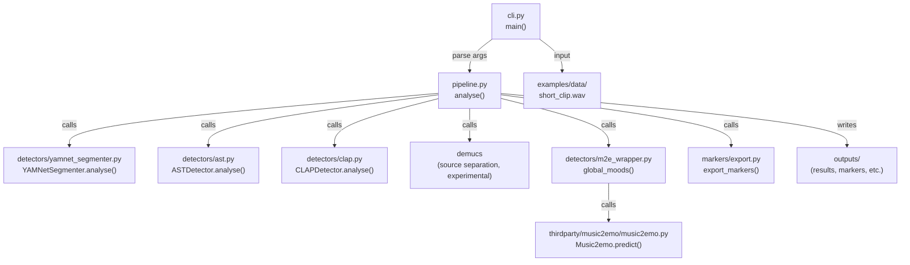

# SibyllAI Core

**Status: 🚧 Work in Progress — Not fully working yet!**

This repository contains the core engine for Motive-AI, an audio-spotting and mood-analysis tool designed to assist with film-music spotting, emotion mapping, and intelligent cue suggestions. The project is under active development and is being refactored for improved modularity and maintainability. 

**Note:**
- The codebase is not yet fully functional. Some features may be incomplete or broken.
- Please check back for updates as development progresses.

---

## Tech Stack
- **Python 3.11+**
- **PyTorch** (deep learning, model inference)
- **TensorFlow & Keras** (legacy and some model support)
- **Hydra** (configuration management)
- **Gradio** (demo UI)
- **Librosa, SoundFile, Essentia** (audio processing)
- **YAMNet** (music/speech segmentation)
- **Demucs** (music source separation, experimental)
- **pytorch-lightning** (training pipeline)
- **Other ML/DS libraries:** scikit-learn, pandas, numpy, etc.

## Project Structure
```
src/
  sibyllai_core/
    cli.py           # Command-line interface
    pipeline.py      # Main analysis pipeline
    detectors/       # Audio/music feature detectors (e.g., AST, CLAP, YAMNet)
    markers/         # Marker and export utilities
    thirdparty/
      music2emo/     # Integrated and modified Music2Emo package
        ...          # (models, utils, configs, etc.)
```
- **examples/data/**: Example audio/video files for testing
- **outputs/**: Default output directory for CLI results

---

## Detailed Code-Level Flow

1. **CLI Entry**
   - **File:** `src/sibyllai_core/cli.py`
   - **Function:** `main()`
   - **What it does:**
     - Parses arguments with `build_parser()`
     - Calls `analyse()` from `pipeline.py`
     - Example:
       ```python
       def main(argv=None):
           args = build_parser().parse_args(argv)
           analyse(pathlib.Path(args.src), pathlib.Path(args.out), args.thr, args.fps)
       ```

2. **Pipeline Orchestration**
   - **File:** `src/sibyllai_core/pipeline.py`
   - **Function:** `analyse(src: Path, out: Path, thr: float, fps: int)`
   - **What it does:**
     - Loads the input file (audio/video)
     - Calls detector modules (see below)
     - Aggregates results
     - Calls marker/export utilities
     - Writes output files to `out` directory

3. **Detectors**
   - **Folder:** `src/sibyllai_core/detectors/`
   - **Files/Functions:**
     - `yamnet_segmenter.py` — e.g., `YAMNetSegmenter.analyse()` (music/speech segmentation)
     - `ast.py` — e.g., `ASTDetector.analyse()`
     - `clap.py` — e.g., `CLAPDetector.analyse()`
     - `m2e_wrapper.py` — e.g., `global_moods()`
   - **What they do:**
     - Each provides a function or class to analyze the input and return features or predictions.

4. **Source Separation (Experimental)**
   - **Demucs** is used to separate music from other stems before mood analysis. This step is experimental and may not be fully stable yet.

5. **Music2Emo Integration**
   - **File:** `src/sibyllai_core/detectors/m2e_wrapper.py`
   - **Function:** `global_moods(wav_path: str, threshold: float = 0.5)`
   - **What it does:**
     - Instantiates `Music2emo` from `thirdparty/music2emo/music2emo.py`
     - Calls `.predict()` on the input file
     - Returns a dictionary with valence, arousal, and mood tags

6. **Music2Emo Model**
   - **File:** `src/sibyllai_core/thirdparty/music2emo/music2emo.py`
   - **Class:** `Music2emo`
   - **Function:** `predict(audio: str, threshold: float = 0.5) -> dict`
   - **What it does:**
     - Loads model weights
     - Extracts features from audio
     - Runs inference and returns predictions

7. **Markers and Export**
   - **File:** `src/sibyllai_core/markers/export.py`
   - **Function:** e.g., `export_markers(results, out_path)`
   - **What it does:**
     - Takes results from detectors/pipeline
     - Writes marker files or other outputs

8. **Output**
   - **Directory:** `outputs/` (or as specified by `--out`)
   - **What's written:**
     - Marker files, analysis results, logs, etc.

---

## Visual Flowchart (Mermaid)



---

## ⚠️ Security Notice: PyTorch Version

This project currently pins `torch==2.2.2` due to compatibility requirements with other dependencies.

- **Known vulnerability:** Remote Code Execution (RCE) via `torch.load` with `weights_only=True` (CVE-2025-32434).
- **Mitigation:**
  - **Do NOT load untrusted model files** using `torch.load`.
  - Avoid using `weights_only=True` with files from untrusted sources.
  - Only use model files you have created or that come from trusted sources.

We will upgrade to a patched version as soon as compatibility allows.
See [GitHub security advisory](https://github.com/pytorch/pytorch/security/advisories/GHSA-53qg-r3pm-6pq6) for more details.
